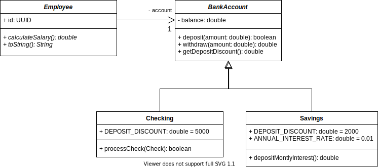

# LAB-ABSTRACT-CLASS

## Dependencias

* Laboratorio de herencia. Shapes.

## Parte I - Corrigiendo `Shapes`

* Modifique el diagrama de clases UML para diseñar que:
    * La clase `Shape` es abstracta.
    * Los métodos `getArea` y `getPerimeter` son abstractos.
* Haga las modificaciones necesarias en el código y verifique que todas las pruebas pasan de forma adecuada.
* En el archivo de SOLUTION.md cargue las imágenes de sus diseños y evidencia de ejecución de pruebas.

## Parte II - Corrigiendo `SabanaPayroll`

* ¿Qué clases pueden ser abstractas en el sistema de nomina?
* Haga los ajustes necesarios en el diagrama de clases y los diagramas de secuencia.
* Haga las modificaciones necesarias en el código y verifique que todas las pruebas pasan de forma adecuada.
* En el archivo de SOLUTION.md cargue las imágenes de sus diseños y evidencia de ejecución de pruebas.

## Parte III - Clases Abstractas Implementando en un contexto

Continuando con el diseño del sistema `SabanaPayroll`, se ha identificado que todos los empleados poseen una cuenta bancaria, dicha cuenta puede ser de dos tipos, de Ahorros (Savings) o Corriente (Checking).

* Para ambas cuentas es posible realizar depositos, operación que consiste en adicionar dinero a la cuenta, sin embargo el banco descuenta un valor constante de 5000 pesos del deposito para las cuentas corrientes y un valor del 2000 para las cuentas de ahorros.
* Para la cuenta de ahorros es posible calcular el porcentaje anual de intereses `ANNUAL_INTEREST_RATE` así como depositar de forma mensual estos intereses `depositMontlyInterest` sin ningún tipo de descuento.
* Las cuentas corrientes son las únicas capaces de recibir depositos por medio de cheques, `processCheck`, si el cheque no se ha vencido, es decir que la fecha actual es menor que la fecha de expiración, se aplica la misma lógica de deposito anteriormente descrita.
* El proceso de retiro para ambas cuentas es el mismo, el banco descuenta el impuesto del 4 x 1000 sobre el monto de cualquier retiro y para cualquier tipo de cuenta.

* Lea el diagrama de clases propuesto.
* El laboratorio tiene adjunto el código de las clases propuestas y las pruebas, integre el código del laboratorio anterior.
* Lea las pruebas con atención.
* Implemente el código necesario en la clase `Cheking` y `BankAccount` para que las pruebas de la clase `Checkingtest` pasen.
* Cree la clase `SavingsTest` y agregue pruebas similares.
* Implemente el código necesario en la clase `Savings` y `BankAccount` para que las pruebas de la clase `SavingsTest` pasen.  

## Parte IV - Clases Abstractas Integrando

1. Use el diagrama de clases inicial para terminar de diseñar el sistema completo, incluya todo lo que considere necesario, atributos, métodos, relaciones.
2. Diseñe el diagrama de secuencia para los métodos `depositToEmployee`, `calculateEmployeeBalance`, y `calculateAllEmployeesBalance`.
3. A la clase `SabanaNominaTest` que ya debe existir agregue diversas pruebas para los métodos anteriormente mencionados.
4. Implemente los métodos y asegurese que las pruebas están bien diseñadas y se ejecutan de manera correcta.
5. En el archivo de SOLUTION.md cargue las imagenes de sus diseños y evidencia de ejecución de pruebas.

## Parte V - Clases Abstractas Diseñando en un contexto

Diseñe el siguiente caso de negocio, no modifique el código, solo proponga el diseño. En el archivo de SOLUTION.md cargue las imagenes de sus diseños.

La universidad ha decidido integrar una tercera forma de pago llamada `UniversityBenefit` que además de funcionar exactamente igual que una cuenta `Savings`, las hay de dos tipos.

* `VacationBenefit`, cuenta con la capacidad de transformar el dinero del balance de la cuenta en día de vacaciones, `withdrawForVacations`, el cual transforma cada 100.000 pesos en un día de vacaiones.
* `CourseBenefit`, por cada 100.000 pesos depositados en la cuenta, agrega 10.000 más por fuera del balance tradicional, ese dinero que regala la Universidad será ahorrado en un balance diferente al tradicional y solo podrá gastarse en cursos dentro de la Universidad.  

 ## Condiciones
 
 * Todos los editables de los diagramas de este laboratorio se encuentran en la carpeta `diagrams`.
 * Cree un repositorio llamado APELLIDO1-APELLIDO2-APELLIDO3-SABANA-POOB-2021-1-LAB-ABSTRACT-CLASS en GitHub y suba a llí la solución del laboratiorio.
 * Cree un archivo SOLUTION.md donde deberá documentar toda la solución del laboratorio. NO MODIFIQUE EL README.md.
